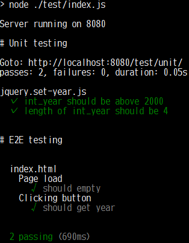

# demo-puppeteer-testing

[](https://travis-ci.org/sutara79/demo-puppeteer-testing)

My practice to use [puppeteer](https://github.com/GoogleChrome/puppeteer) and [Mocha](https://github.com/mochajs/mocha).

## Testing
### Browser
https://sutara79.github.io/demo-puppeteer-testing/test/unit/

### CLI
```
npm test
```



## Author
Yuusaku Miyazaki <toumin.m7@gmail.com>